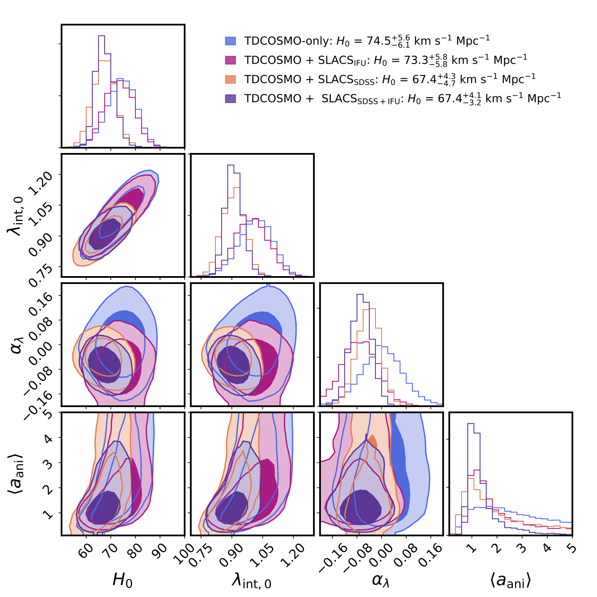

===================================
Hierarchical Time Delay Cosmography
===================================

This repository hosts the complete pipeline of the hierarchical time delay cosmography analysis presented by the TDCOSMO collaboration presented in `Birrer et al. 2020 <https://arxiv.org/abs/2007.02941>`_. This includes all data products taken from the literature, sampling and diagnostic scripts. All plots presented in the paper can be reproduced with the jupyter notebooks presented here.

If you make usage of data products of this repository, please make sure you cite the relevant publications where these were presented first.
If you make use of analysis scripts presented here, please cite  `Birrer et al. 2020 <https://arxiv.org/abs/2007.02941>`_ and all software those scripts rely on.

Structure of Repository
-----------------------
This repo is structured as follow:

* ``MST_impact``: notebooks to illustrate the MST (Section 2 in Birrer et al. 2020)
* ``TDLMC``: contains all the data products and analysis routines for the validation of the hierarchical analysis on the Time Delay Lens Modeling Challenge (Section 4 in Birrer et al. 2020).
* ``TDCOSMO_sample``: contains all the data products and analysis routines to perform the hierarchical analysis on the 7 time delay lenses of the TDCOSMO sample (Section 5 in Birrer et al. 2020).
* ``SLACS_sample``: contains all the data products and analysis routines to perform the hierarchical analysis on the SLACS lenses (Section 6 in Birrer et al. 2020)
* ``JointAnalysis``: performs the joint hierarchical analysis of the TDCOSMO+SLACS sample with the likelihood products derived in the respective folders (Section 7 in Birrer et al. 2020).

Dependencies
------------

The analysis pipeline heavily relies on the python software packages `hierArc <https://github.com/sibirrer/hierArc>`_ (`Birrer et al. 2020 <https://arxiv.org/abs/2007.02941>`_) version 1.0.0 and `lenstronomy <https://github.com/sibirrer/lenstronomy>`_
(`Birrer & Amara 2018 <https://arxiv.org/abs/1803.09746v1>`_ ) version 1.5.1, both available through PyPi, on top of standard python libraries.

If you have questions about the usage, citation redits or encounter problems, please get in touch with Simon Birrer (sibirrer@gmail.com).